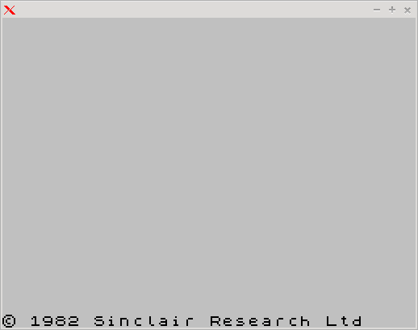
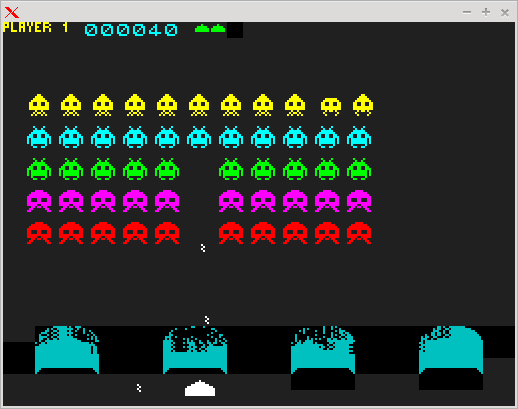

# Emulador de Z80/ZX Spectrum

Estos emuladores son ejemplos para que pueda verse que con **lms** pueden crearse programas medianamente complejos. El
emulador de Z80 pasa los test **zexdoc** de instrucciones documentadas y **zexall** de instrucciones no documentadas.

El emulador de ZX Spectrum no es mas que un uso del modulo de Z80 que define la instrucciones **in** y **out** para poder
leer las teclas y enviar sonido y un modulo que llama a las funciones de la libX11 para poder presentar la pantalla. He incluido
la rom del proyecto **opense-basic** ya que es GPL y puede distribuirse sin problemas.

Hay que decir que tanto el emulador de Z80 como de Spectrum no tienen una temporización ni medianamente precisa y si se mira el
codigo, hay un bucle que se ejecuta antes de cada instruccion, y cada 40000 instrucciones se genera una interrupción, con lo que
en mi maquina es usable.

Incluyo un par de pantallazos...

